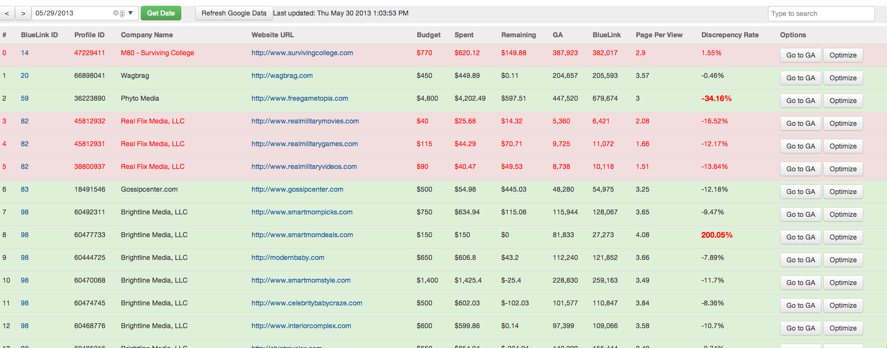
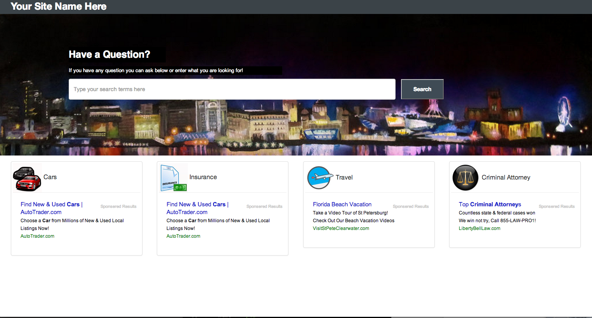
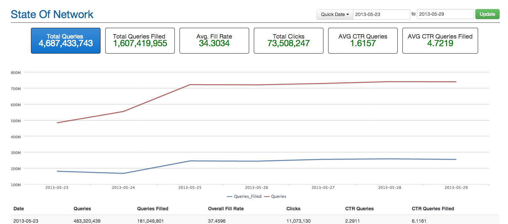
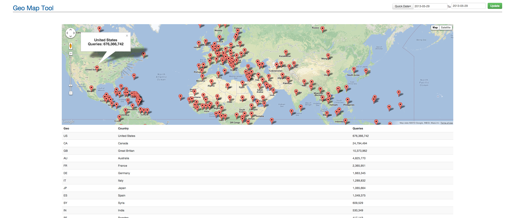
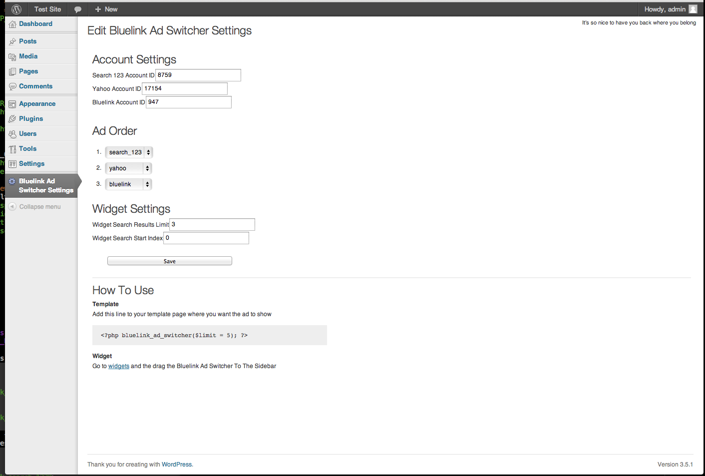
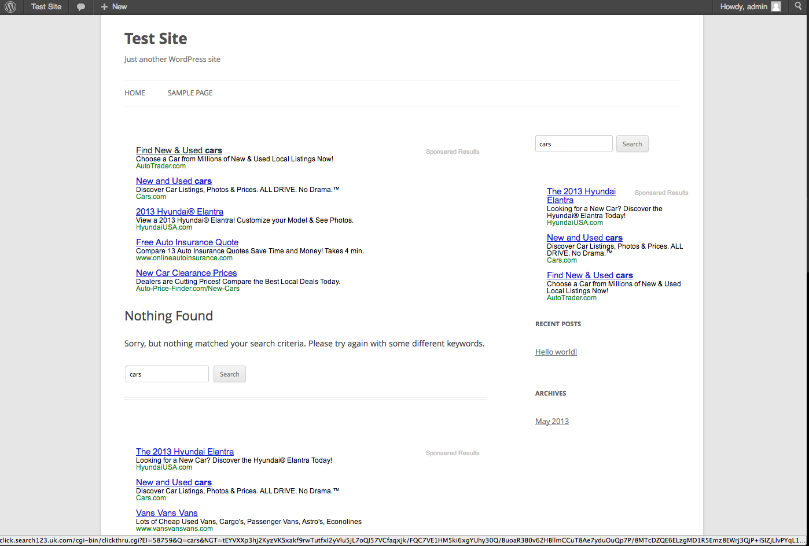

Collection of My Work 
==============
By David Holmes 
	This is a collection of my work at Bluelink Marketing
	** <b>For Internal Purposes only </b>**
<h2>Ga Stats</h2>

This was the first project I worked on at Bluelink it.I had to create a way to see all of our 
websites managed or owned and operated GA Stats all on one list along with how much we earned
I also had the table colored cordinated by what sites was doing bad and what sites was doing good.
I had to use the GA Stats to create this 

<h2>Domain Parking Page</h2>

At out company we have a ton of parked domain pages that are not being used
To better make use of them we created a park page that returns our ads when you do a search
or shows high value category ads incase a user is interested in one at the time of the visit.
The whole page was designed to attract clicks as much as possible.

<h2>State Of Network</h2>

Stats are important. A large part of my job is making sure that we can see all of our stats. 
These stats are the state of the network. This is a breakdown of what our system is pushing out on a daily baises  

<h2>Geo Map Tool</h2>

This was one of my cooler projects. We are storing where all of our ad queires come from and I had some free time and decided to put them 
all on a map and display them by country.

<h2>Ad Switcher For Wordpress Plugin</h2>

This was a wordpress plugin I worked on so that way we can show our ads along with some of our partners ads on our search pages 

